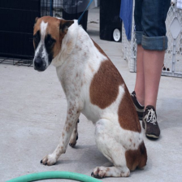

# PyTorch Implementation (WIP)

* Usage
~~~
python trainer.py \
-- data HYBRID \
-- data_path \path\to\sbd\
-- val_data_path \path\to\VOCdevkit\
-- model_name fcn8s \
-- mode finetuning \
-- optimzizer Adam \
-- lr 1e-4 \
-- n_epoch 200 \
-- check_step 20 \
-- batch_size 32 \
~~~

* Dataset: [Pascal VOC 2012](http://host.robots.ox.ac.uk/pascal/VOC/voc2012/) & [SBD](http://home.bharathh.info/pubs/codes/SBD/download.html)
  * train: SBD "train.txt" (8498)
  * test:  "val_no_sbd.txt"(904)
    * Images of VOC2012 "val.txt" that is not included in SBD "train.txt"
  
* Result
  * Pixel Accuracy
    * train: 0.9494
    * test: 0.8951
  * train-loss: 0.187611948

* Samples

| input image | output mask |
| ----------- | ----------- |
|  |  |
|  |  |
|  |  |
|  |  |
|  |  |
|  |  |
|  |  |
|  |  |
